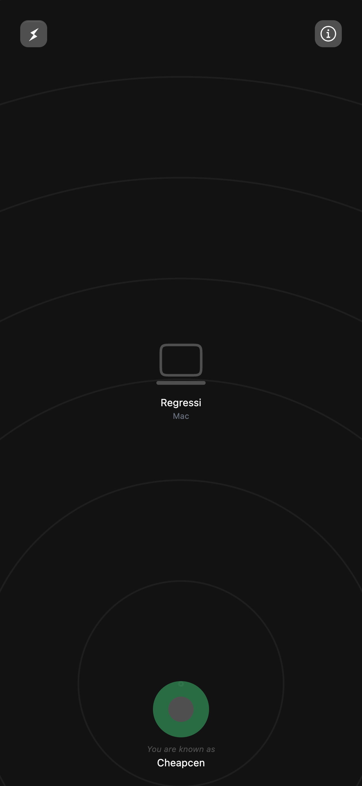

<!-- PROJECT LOGO -->
<br />
<div align="center">
  <a href="https://github.com/github_username/repo_name">
    
  </a>

<h3 align="center">fyla</h3>

  <p align="center">
    P2P file-sharing
    </p>
    <br />
    <a href="https://fylo.vercel.app"  target="_blank">View Demo</a> &nbsp;
   <a href="https://github.com/amithjayapraban/fyla_backend"  target="_blank">Backend Repository</a>

  </p>
</div>

<!-- ABOUT THE PROJECT -->

## About The Project

fyla is a peer-to-peer (P2P) file-sharing web application designed to make file transfers seamless and efficient. By leveraging WebRTC for direct peer-to-peer communication and WebSockets for signaling, fyla eliminates the need for centralized servers during file transfers, ensuring privacy and speed.

### Key Features

- **Real-Time File Sharing**: Share files instantly between peers without any intermediary servers.
- **Cross-Platform Compatibility**: Works on modern web browsers, ensuring accessibility across devices.
- **Secure Communication**: Uses WebRTC's encryption to ensure secure data transmission.
- **Lightweight and Fast**: Built with React and Tailwind for a responsive and user-friendly interface.

This project is ideal for anyone looking to explore the potential of P2P technologies or seeking a simple solution for direct file sharing.

### Screenshots

<div align="left">

  
 
</div>

### Built With

- React
- Tailwind
- WebRTC
- WebSockets

<!-- GETTING STARTED -->

## Getting Started

### Prerequisites

- npm
  ```sh
  npm install npm@latest -g
  ```

### Installation

1. Clone the repo
   ```sh
   git clone https://github.com/amithjayapraban/p2p.git
   ```
1. Install NPM packages
   ```sh
   npm install
   ```

<!-- CONTRIBUTING -->

## Contributing

Contributions are what make the open source community such an amazing place to learn, inspire, and create. Any contributions you make are **greatly appreciated**.

If you have a suggestion that would make this better, please fork the repo and create a pull request. You can also simply open an issue with the tag "enhancement".
Don't forget to give the project a star! Thanks again!

1. Fork the Project
2. Create your Feature Branch (`git checkout -b feature/AmazingFeature`)
3. Commit your Changes (`git commit -m 'Add some AmazingFeature'`)
4. Push to the Branch (`git push origin feature/AmazingFeature`)
5. Open a Pull Request

<!-- LICENSE
## License

Distributed under the MIT License.
-->

<!-- ACKNOWLEDGMENTS -->

## Acknowledgments

- [WebRTC](https://webrtc.org)
- [javascript.plainenglish.io](https://javascript.plainenglish.io/build-a-p2p-image-sharing-app-with-webrtc-and-react-fe6b3d1976d5)
